# Pearl Hunt

> Find the pearl from my bag of shells

[Loihde](https://www.loihde.com/)'s CTF Challenge for [Disobey 2025](https://disobey.fi/2025/).

The source code has been published with permission from Loihde.

## Special thanks

- [melakeiju](https://github.com/melakeiju) - Co-author for [Forensics Challenge](#forensics-challenge)
- Severi Muona - Inspiration for [Shelldon's Cave](#shelldons-cave)
- Otto Kemppainen - Playtesting
- Kristiina Luomala / TwinEngine - Playtesting the [walkthrough](#walkthrough)
- [Loihde CSOC](https://www.loihde.com/en/services/cybersecurity/csoc)

## Deployment

**NOTE**: Deploying the final challenge has only been tested with Linux. Using WSL2 with Windows works.

Install the following applications:

- Docker
- [Docker Compose plugin](https://docs.docker.com/compose/install/linux)

Build and run the Docker container (requires internet connection):

```bash
docker compose build
docker compose up -d
```

You can get the IP address for the container with the following command (required for connecting its SSH server):

```bash
docker inspect -f "{{range.NetworkSettings.Networks}}{{.IPAddress}}{{end}}" disobey-finale
```

## Walkthrough

### Forensics Challenge

<details>
<summary>Spoiler warning</summary>

The player is given a ZIP package [bag.zip](./bag.zip) containing the following files:

- \$MFT
- UsrClass.dat

The player is expected to find the Pearl (_PEARL.txt_) inside a password-protected 7z archive _pearl.7z_. The 7z archive was deleted from the filesystem, but its MFT (Master File Table) entry had not yet been overwritten at the time of evidence acquisition, meaning the metadata was still present in MFT. Most importantly, the file is small enough for it to be entirely resident in the MFT entry. The 7z archive's password can be found from the Alternate Data Stream (ADS) attribute called "pw" in the file _pearl.7z_'s MFT entry.

The evidence collection name _bag.zip_ and introduction text of the challenge give a hint that ShellBags (_Bags_/_BagMRU_ registry keys) could be a place to start. One of the artifacts provided, UsrClass.dat, contains evidence about the folders the user has explored via File Explorer. Eric Zimmerman's ShellbagExplorer is one tool that can parse and review the Shellbag data. By reviewing Bags and BagMRU registry keys of the UsrClass.dat, it's apparent that there is or has been a _pearl.7z_ archive file in user shelldon's Desktop in path "C:\Users\shelldon\Desktop\shiny_secrets\pearl.7z". This seems interesting, and we'd like to carve that file.

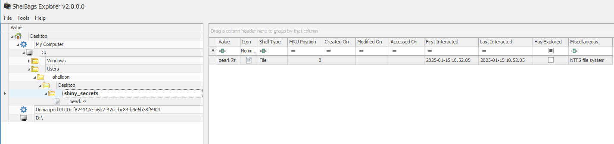

Now that we have identified an interesting file on the system, we need to look into it further. We know that \$MFT artifact contains metadata/data of every file in the file system. There are multiple ways to approach this. You can create a file system timeline using MFTECmd and identify the inode of the pearl.7z MFT entry. MFTECmd also allows you to examine alternate data streams in the file.

We can also open the \$MFT file in a hex editor like HxD and search for the file of interest (pearl.7z).

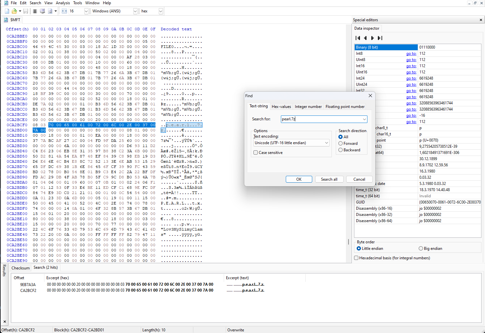

After going to the line containing pearl.7z, we'll notice that the MFT entry starts at offset 0xCA2BC00 with magic bytes of "46 49 4C 45" (FILE).

Another thing that quickly catches our attention is something that looks like a password. It's in the DATA attribute called "pw" and contains a string: **Lov3MySlimyClams**

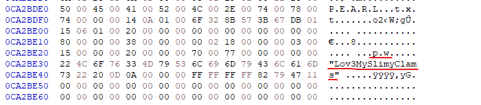

The MFT entry's \$DATA attribute starts with a header 0x80. There are two \$DATA attributes for the file, the file itself and the previously mentioned ADS.

To analyze the entry, we need to look at attributes and data at different offsets. Helpful resources:

* https://www.futurelearn.com/info/courses/introduction-to-malware-investigations/0/steps/147562
* https://www.acperpro.com/papers/articles/ISITES2018ID88.pdf

We're interested in the primary \$DATA attribute containing the data of the 7z file itself. The non-resident flag is at offset 0x08 of the $DATA attribute. In this case, it is set to 0, meaning that the file, indeed, is resident and entirely in the MFT entry.

Offset 0x10 tells us the content length of the file's resident data and offset 0x14 gives the offset where this data begins. We can now grab the resident data of the file and save it as a .7z file.

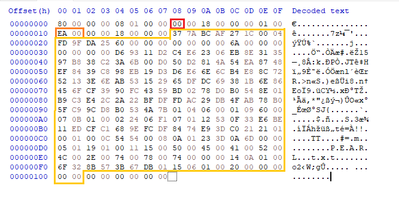

Decrypt the .7z archive with a password from ADS (Lov3MySlimyClams) and open the _PEARL.txt_ file, only to find out that the pearl is gone. Remember the code and head upstairs to Loihde's stand.

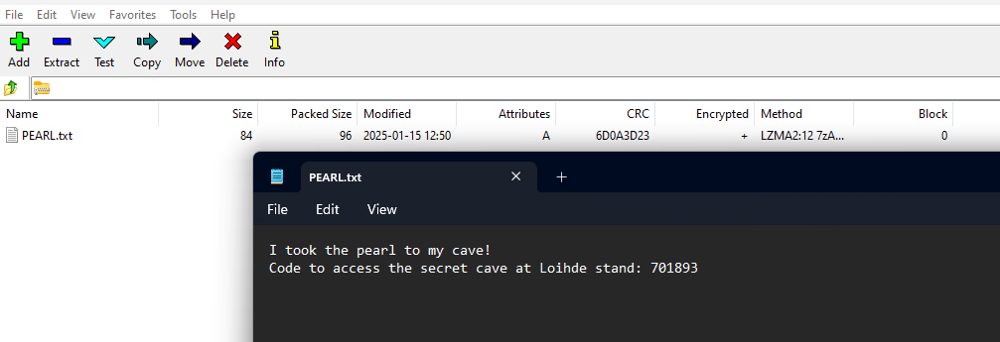

</details>

### Shelldon's Cave

<details>
<summary>Spoiler warning</summary>

There was a door in Loihde's stand with a sign "Shelldon's Cave". The door is locked with an electric lock that can be opened by entering the code from the previous section to the access control panel.

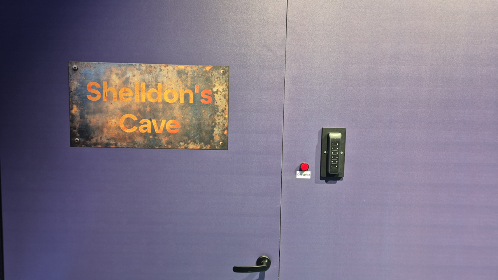

Inside the room, there is a joystick and a monitor on a desk. The monitor displays a camera feed from a room, which by default is pointed to a funny character. Turning the joystick makes the camera move. The player is expected to find SSH credentials from the room through the camera.

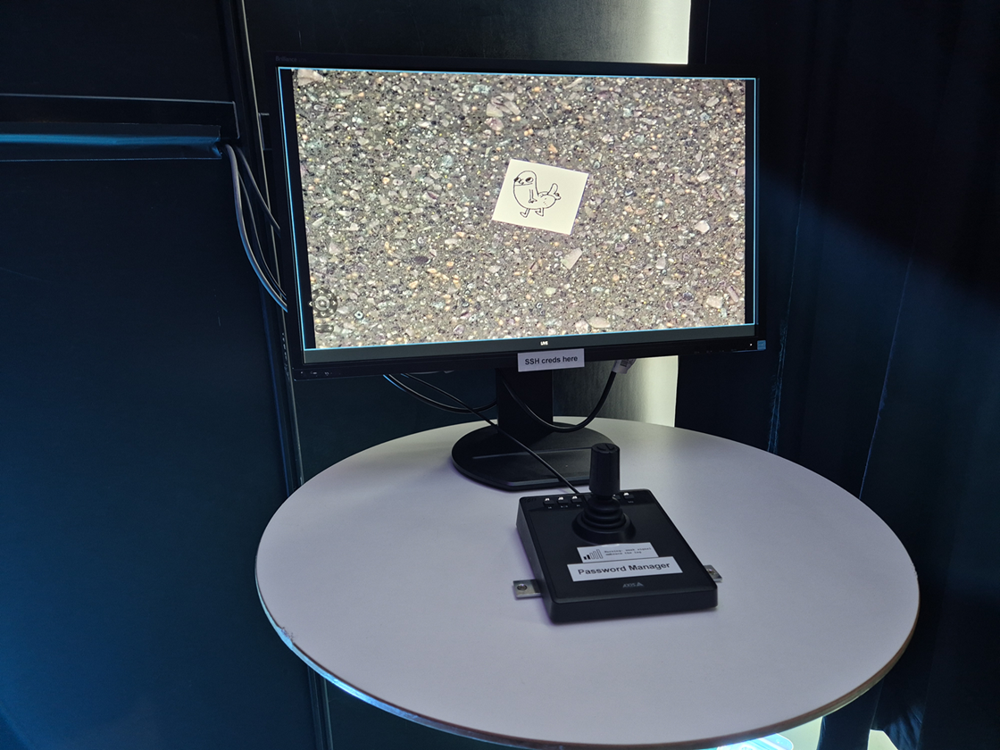

The recorded room is full of small things of interest. The things contain the wanted SSH credentials, but there are also a lot of other distractions, like memes. Luckily, the joystick has some buttons that contain helpful preset positions for the camera. For example, the button with a flag icon displays the IP address and port to the player. A few other presets have zoomed-out views of the room so that all SSH credential information is visible from the presets. The rest of the buttons of the joystick zoom to some memes and other rabbit holes. One such rabbit hole was an empty arrow pointing up. If the player were to turn the camera up from the arrow, they would see the [Salt Bae](https://knowyourmeme.com/memes/salt-bae) meme, a guy sprinkling salt from his hands.

**SSH Credentials**

- IP Address: 172.30.125.73
- TCP Port: 42222
- Username: shelldon
- Password: PennyGetYourOwnWifi

**NOTE**: If you want to play the [Final Challenge](#final-challenge) at home, change the IP address to the IP address of the Docker container you deployed.

See: [Deployment](#deployment)

**Shelldon's Cave speedrun, any% (World Record)**


</details>

### Final Challenge

<details>
<summary>Spoiler warning</summary>

You can use the SSH credentials found from Shelldon's Cave to SSH into the final challenge server. You will find an executable called `unshellable`, which is an executable compiled from [unshellable.torth](./unshellable.torth) using [Torth](https://github.com/frendsick/Torth) compiler. The executable is a SUID binary owned by the `root` user, meaning the binary is executed as the `root` user. Unfortunately, running the script does not do anything meaningful.

```
shttycave:~$ ls -lah
total 28K
drwxr-sr-x    1 shelldon shelldon    4.0K Jan 23 08:54 .
drwxr-xr-x    1 root     root        4.0K Jan 23 08:54 ..
-rwsr-xr-x    1 root     root       12.7K Jan 23 08:54 unshellable
shttycave:~$ ./unshellable
TTYpical mistake!
```

The error message _TTYpical mistake!_ hints that shells nor any other TTYs cannot open the `unshellable` executable. The challenge requires figuring out a way how to run the executable without an attached TTY. One solution would be to run commands directly through SSH.

```
$ ssh ctfuser@172.30.125.73 ./unshellable
ctfuser@172.30.125.73's password:
I demand password
```

Password demanded, huh? Let's give one!

```
$ ssh ctfuser@172.30.125.73 ./unshellable password
shelldon@172.30.125.73's password:
What's the password, you ask? Oh, I can't tell you that, it's top-secret.
```

So, the binary requires a top-secret password. Let's dive deeper by downloading the binary via SFTP and reverse engineering it.

I started reversing by gathering basic information from the file.

```
$ file unshellable
unshellable: ELF 64-bit LSB executable, x86-64, version 1 (SYSV), statically linked, stripped
$ strings unshellable
...
TTYpical mistake!
I demand password
 is not a secure password
What's the password, you ask? Oh, I can't tell you that, it's top-secret.
/root/flag.txt
Well, then it looks like we have a winner. Congratulations.
Please celebrate with free cold drinks from Loihde's counter!
File '
' does not exist.
Cannot open file '
': Permission denied.
The 'path' argument for SYS_open points to inaccessible memory location.
Error occurred while opening the file '
Error code:
...
```

The `file` command shows that the binary is statically linked, so the program is self-contained and does not depend on any DLLs. It is also stripped, meaning the program is compiled without debugging symbols, making reverse engineering a notch more difficult.

The `strings` command lists printable strings from the binary. The output shows interesting strings, like "/root/flag.txt", which could be the file where the flag is located.

Let's investigate further. I will present two alternative approaches for reverse engineering the binary, [static analysis](#static-analysis) and [dynamic analysis](#dynamic-analysis).

#### Static analysis

I am using [Radare2](https://rada.re/n/radare2.html) during the static analysis walkthrough.

First, I want to find out how the interesting strings are related to the program. After the basic analysis command `aaaa`, I wanted to know where the "/root/flag.txt" file was referenced.

```
[0x00401000]> / /root/flag.txt
0x0040308c hit3_0 .'s top-secret./root/flag.txtFlag: 0\.
[0x00401000]> axt 0x0040308c
entry0 0x4010d7 [STRN:r--] movabs rsi, str._root_flag.txt
```

The "/root/flag.txt" is referenced at the end of the `entry0` function of the program, followed by messages indicating that the challenge is solved. Before those references, we can see multiple conditional blocks of code. Most likely, we would get the flag by getting through these conditions. The Radare's visual graphs mode visualizes the code branches that can be executed based on the jump conditions. The green lines show what branch will be executed when jump conditions are true, and the red line branch is executed if it is false. The assembly code on the left of the following screenshot is from the bottom-most code block of the graph on the right, marked as `@@@@@@`.

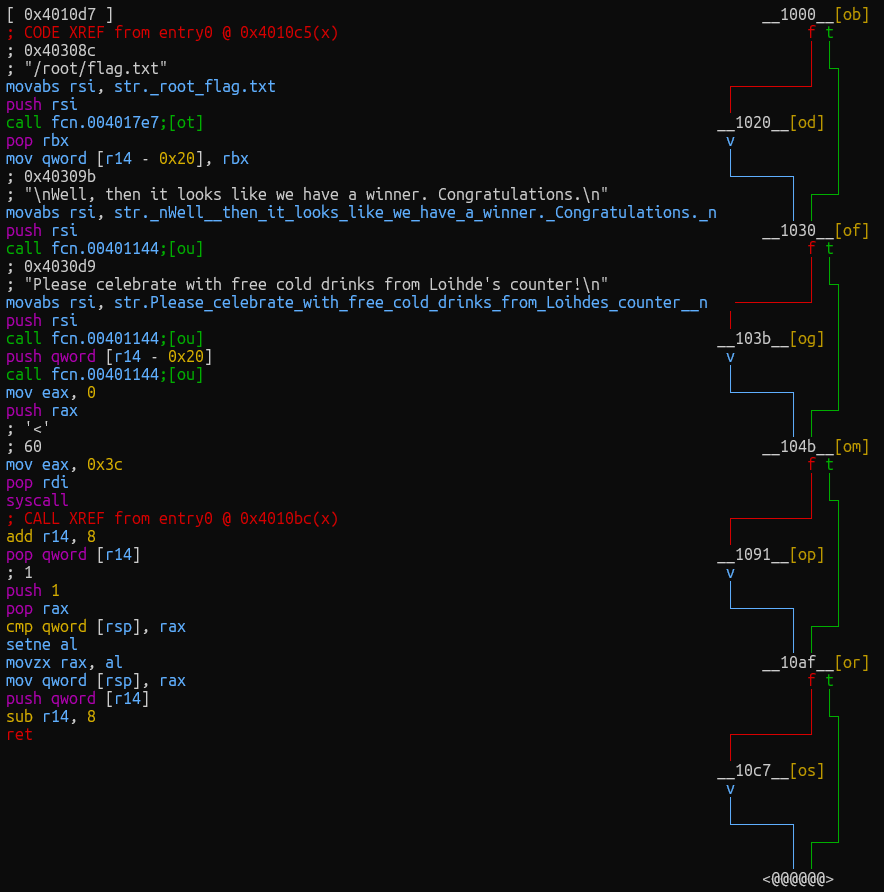

Let's check what conditions are required from us. The first condition leads to the familiar error message "TTYpical mistake!".

I will rename the functions as I go to make the binary easier to understand. Here, I named the function before the condition `is_tty_attached` and the function after it `exit_with_error`.

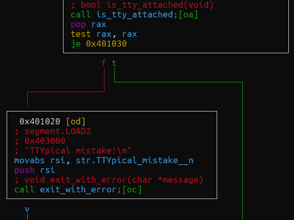

Next, the binary tries to parse the command line argument and prints the second familiar message, "I demand password!" if an argument is not given.

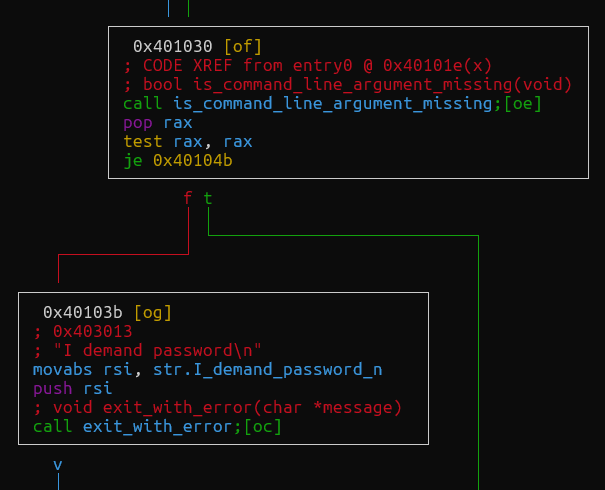

We also know that with a wrong password, the program is expected to print "What's the password, you ask? Oh, I can't tell you that, it's top-secret.".

However, the next condition block is something else: " is not a secure password". What is not a secure password? Googling "is not a secure password" gives multiple different possibilities, like _password_. There is also a book called "1234 is not a secure password", which makes sense, as the number _1234_ does appear before the condition in the binary. It is also a quote from [Sheldon Cooper](https://the-big-bang-theory.com/quotes/quote/90/).

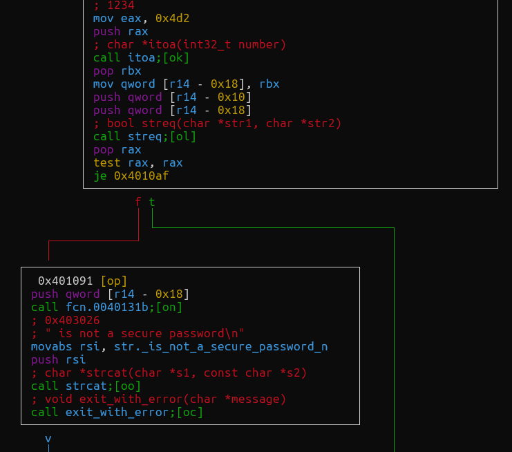

The easter egg condition is followed by the familiar condition for the "What's the password, you ask? Oh, I can't tell you that, it's top-secret." message. Now, we need to figure out what the password is.

The condition for the correct password compares string values stored in memory locations `[r14 - 0x10]` and `[r14 - 8]`.

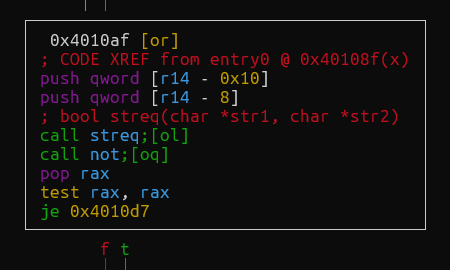

Let's see where they are defined.

The memory location `[r14 - 0x10]` contains a dynamically parsed string, assumably the command line parameter. The other memory location `[r14 - 8]` must then be the password. Its value is from a function. Let's call it `get_password`.

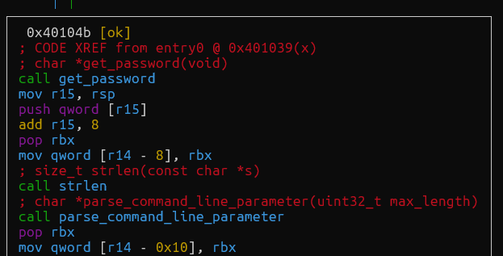

The `get_password` function reads a static string from the `.data` section and pushes it to the stack.

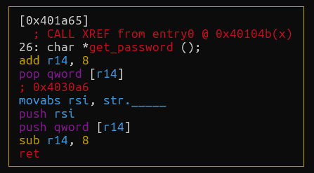

The string's contents can be found by listing the strings in data sections with the `iz` command. The string in the memory location `0x0040311b` refers to a UTF-8 string `¯\_(ツ)_/¯`, the _shrug_ emoticon. This could be the password.

```
[0x00401000]> iz
[Strings]
nth paddr      vaddr      len size section type  string
―――――――――――――――――――――――――――――――――――――――――――――――――――――――
0   0x00003000 0x00403000 18  19   .data   ascii TTYpical mistake!\n
1   0x00003013 0x00403013 18  19   .data   ascii I demand password\n
2   0x00003026 0x00403026 26  27   .data   ascii  is not a secure password\n
3   0x00003041 0x00403041 74  75   .data   ascii What's the password, you ask? Oh, I can't tell you that, it's top-secret.\n
4   0x0000308c 0x0040308c 14  15   .data   ascii /root/flag.txt
5   0x0000309b 0x0040309b 61  62   .data   ascii \nWell, then it looks like we have a winner. Congratulations.\n
6   0x000030d9 0x004030d9 62  63   .data   ascii Please celebrate with free cold drinks from Loihde's counter!\n
7   0x0000311b 0x0040311b 9   14   .data   utf8  ¯\_(ツ)_/¯
...
```

As the emoticon contains some odd characters, at least Bash Shell interprets some characters non-literally. After some trial and error, we are able to run the binary with the literal _shrug_ emoticon as the password and get the flag. 

```
$ ssh shelldon@172.30.125.73 ./unshellable ¯\_(ツ)_/¯
-bash: syntax error near unexpected token `('
$ ssh shelldon@172.30.125.73 './unshellable ¯\_(ツ)_/¯'
shelldon@172.30.125.73's password:
bash: -c: line 1: syntax error near unexpected token `('
bash: -c: line 1: `./unshellable ¯\_(ツ)_/¯'
$ ssh shelldon@172.30.125.73 './unshellable "¯\_(ツ)_/¯"'
shelldon@172.30.125.73's password:

Well, then it looks like we have a winner. Congratulations.
Please celebrate with free cold drinks from Loihde's counter!
FLAG{FUN_WITH_FLAGS_EP1337}
```

#### Dynamic analysis

I am using [Radare2](https://rada.re/n/radare2.html) and GDB during the dynamic analysis walkthrough.

To make dynamic analysis of the binary easier, we can patch it so that it can be run using a TTY. To patch the binary, it must be opened with Radare in write mode `r2 -w ./unshellable`.

Let's find the condition that is followed by the "TTYpical mistake!" error message. First, I ran the analysis command `aaaa` and then located where the "TTYpical mistake!" string is referenced.

```
[0x00401091]> / TTYpical mistake!
0x00403000 hit4_0 .TTYpical mistake!I demand passw.
[0x00401091]> axt 0x00403000
entry0 0x401020 [STRN:r--] movabs rsi, str.TTYpical_mistake__n
[0x00401091]> s 0x401020
[0x00401020]>
```

I entered the visual graphs mode with the command `VV` to make visually inspecting the binary easier. There, we can see that the `je 0x401030` instruction in address `0x0040101e` is the culprit for checking if the program is running with TTY attached.

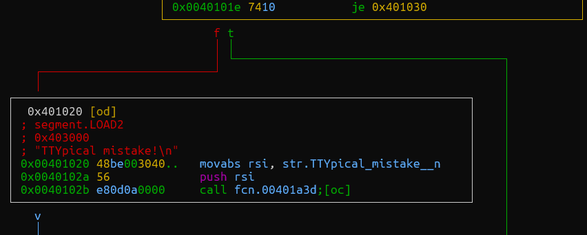

Would it not be convenient if we could flip the logic of the `je` instruction? Let's flip the logic by changing the `je` (opcode 0x74) instruction to `jne` (opcode 0x75)!

Ref: [Intel x86 Opcode Table and Reference](https://shell-storm.org/x86doc/)

```
[0x00401000]> s 0x0040101e
[0x0040101e]> pxl 1
- offset -  1E1F 2021 2223 2425 2627 2829 2A2B 2C2D  EF0123456789ABCD
0x0040101e  7410 48be 0030 4000 0000 0000 56e8 9a09  t.H..0@.....V...
[0x0040101e]> wv1 0x75
[0x0040101e]> pxl 1
- offset -  1E1F 2021 2223 2425 2627 2829 2A2B 2C2D  EF0123456789ABCD
0x0040101e  7510 48be 0030 4000 0000 0000 56e8 9a09  u.H..0@.....V...
```

After patching the binary, we do not get the "TTYpical mistake!" error message anymore!

```
$ ./unshellable
I demand password
$ ./unshellable password
What's the password, you ask? Oh, I can't tell you that, it's top-secret.
$ ./unshellable 1234
1234 is not a secure password
```

Now, we can run the program in a debugger, set a breakpoint to the point of execution where the password is checked, and hope that the password is baked into the program's memory. From Radare, I found that the code block starting at address `0x4010af` should be responsible for checking the password.

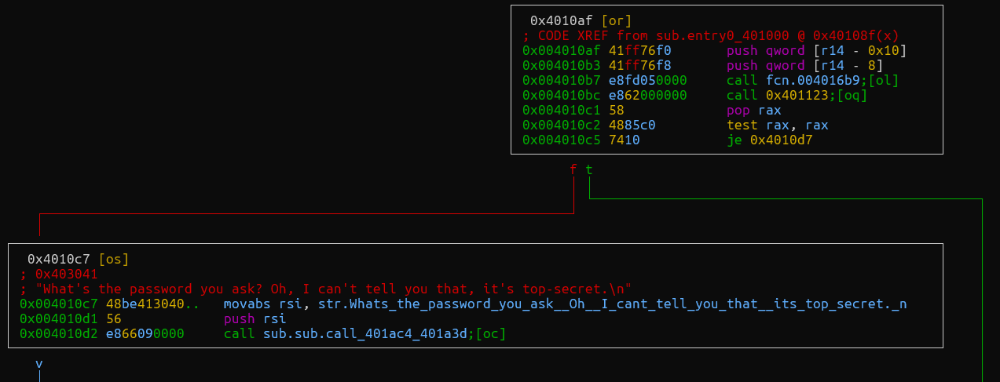

I am using GDB as my debugger of choice. I opened the program with GDB, set a breakpoint to the code block starting at `0x4010af`, and executed the program with _testpass_ as the command line argument.

```
$ gdb -q ./unshellable
Reading symbols from ./unshellable...
(No debugging symbols found in ./unshellable)
(gdb) break *0x4010af
Breakpoint 1 at 0x4010af
(gdb) run testpass
Starting program: /tmp/unshellable testpass

Breakpoint 1, 0x00000000004010af in ?? ()
```

From Radare, we know that the program uses values in addresses `[r14 - 0x10]` and `[r14 - 0x8]` for something. Let's print their values now that we are here.

```
(gdb) x/s *(char**) ($r14-0x8)
0x4030a6:       "¯\\_(ツ)_/¯"
(gdb) x/s *(char**) ($r14-0x10)
0x7fffffffe70d: "testpass"
```

We found that our input is located in `[r14 - 0x10]`, while the other address contains the _shrug_ emoticon `¯\_(ツ)_/¯`. Let's test if that is the password!

```
$ ./unshellable ¯\_(ツ)_/¯
-bash: syntax error near unexpected token `('
$ ./unshellable "¯\_(ツ)_/¯"
Cannot open file '/root/flag.txt': Permission denied.
```

Nice! We got permission denied from `/root/flag.txt`, which is the path we saw in the binary's strings! Now, just run the `unshellable` program on the CTF server over SSH using the password to get the flag.

```
$ ssh shelldon@172.30.125.73 './unshellable "¯\_(ツ)_/¯"'
shelldon@172.30.125.73's password:

Well, then it looks like we have a winner. Congratulations.
Please celebrate with free cold drinks from Loihde's counter!
FLAG{FUN_WITH_FLAGS_EP1337}
```
</details>
